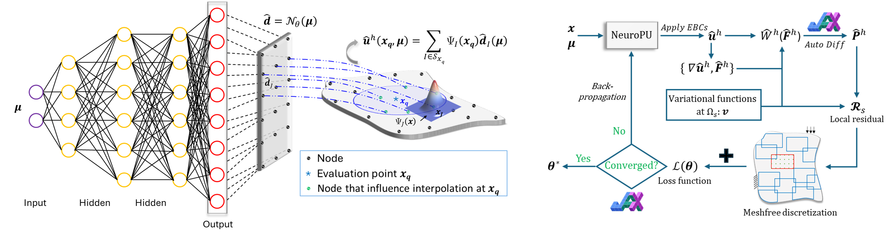

# Neural-Integrated Meshfree (NIM) Method: A differentiable programming-based hybrid solver

### [Paper1](https://www.sciencedirect.com/science/article/pii/S0045782524002809), [Paper2](https://arxiv.org/abs/2407.11183)

## Overview
The neural integrated meshfree (NIM) method is a GPU-accelerated **differentiable meshfree** computational approach built on [JAX](https://github.com/jax-ml/jax). It is specifically designed for forward and inverse modeling of elastic and inelastic materials using particle-based simulations. This repository provides the data and code supporting the accompanying paper.




## Requirements
Python libraries required:
- jax
- tqdm
- scipy
- jaxopt
- tqdm

## Installation
To install the required Python libraries, run the following command:

pip install jax tqdm scipy jaxopt

## Tutorial Examples

### 1D Hyperelasticity using V-NIM
Explore the 1D Hyperelasticity model using the V-NIM method provided below:
- **[Code for NIM/c](1D_hyperelasticity/NIM-C_1D_hyperelasticity_Tutorial.ipynb)**

- **[Code for NIM/h](1D_hyperelasticity/NIM-H_1D_hyperelasticity_Tutorial.ipynb)**

### Forward modeling for time dependent problem (advection diffusion equation) using S-NIM

- **[Forward modeling](Advection_diffusion_equation_forward/JAX_SNIM_ADE_forward.py)**


* More examples demonstrating the application of the NIM method, including operator learning, inverse identification, elastoplasticity modeling, and geophysical simulation under extreme loading, will be released soon. Stay tuned for updates!


## Acknowledgements
Contributors: Honghui Du (Graduate student), QiZhi He (PI)<br>

## Citation

```bibtex
@article{du2024neural,
  title={Neural-Integrated Meshfree (NIM) Method: A differentiable programming-based hybrid solver for computational mechanics},
  author={Du, Honghui and He, QiZhi},
  journal={Computer Methods in Applied Mechanics and Engineering},
  volume={427},
  pages={117024},
  year={2024},
  publisher={Elsevier}
}

@article{du2024differentiable,
  title={Differentiable Neural-Integrated Meshfree Method for Forward and Inverse Modeling of Finite Strain Hyperelasticity},
  author={Du, Honghui and Guo, Binyao and He, QiZhi},
  journal={arXiv preprint arXiv:2407.11183},
  year={2024}
}

```
